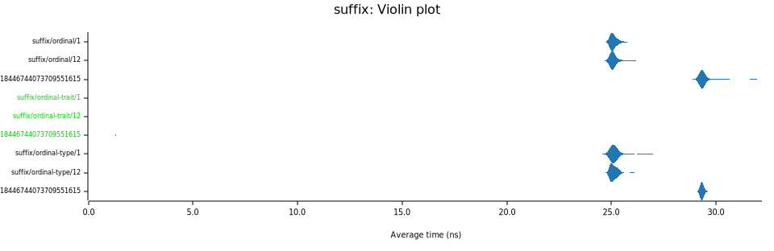

# Ordinal formatting

Format numbers as ordinals efficiently.
You can get the ordinal suffix e.g., "st", "nd", "rd", or "th" without allocations.

## Examples

Format a number as an ordinal, allocating a new `String`:

```rust
use ordinal::ToOrdinal as _;
assert_eq!(12.to_ordinal_string(), "12th");
```

Get a number representing an ordinal you can use with comparisons and formatting.

```rust
use ordinal::ToOrdinal as _;
let n = 12.to_ordinal();
assert_eq!(*n, 12);
assert_eq!(format!("{n}"), "12th");
```

## Features

* **std**: (default) all functionality enabled.
* **alloc**: (default; enabled by **std**) all functionality enabled.

This crate supports `no_std`, though functionality is limited. If you disable default features, `no_std` will be enabled.
You can optionally add feature `alloc` (enabled by default with `std`) to enable all functionality without requiring `std`.

```bash
cargo add ordinal-trait --no-default-features --features alloc
```

## Performance

Compared to most other implementations that allocate a string just to check the last one or two characters, this implementation is much faster and does not allocate a string.



Formatting ordinals builds on this strategy and is faster than most other implementations:


To [compare measurements](https://bheisler.github.io/criterion.rs/book/user_guide/command_line_options.html#baselines) across branches:

```bash
git checkout main
cargo bench -- --save-baseline main

git checkout feature
cargo bench -- --baseline main
```

## Memory profiling

Criterion does not support memory profiling as of 0.5.1; however, I have implemented a simple solution using a global
allocator. When run with `--profile-time <number of seconds>`, the total number of bytes allocated from the heap will
be written to the terminal in kibibytes. This may include heap allocations for Criterion itself, but should be limited
to just before and after each benchmark.

```bash
cargo bench -- suffix --profile-time 3
```

Would print something like:

```text
Benchmarking suffix/ordinal/1: Profiling for 3.0000 s; allocated 0 KiB
Benchmarking suffix/ordinal/1: Complete (Analysis Disabled)
Benchmarking suffix/ordinal@0.3.2/1: Profiling for 3.0000 s; allocated 958,951 KiB
Benchmarking suffix/ordinal@0.3.2/1: Complete (Analysis Disabled)
Benchmarking suffix/ordinal-type/1: Profiling for 3.0000 s; allocated 949,659 KiB
Benchmarking suffix/ordinal-type/1: Complete (Analysis Disabled)
...
```

## History

This crate was previously published as [`ordinal-trait`](https://crates.io/crates/ordinal-trait) to format numbers efficiently.
After coming across [gleich/ordinal#3](https://github.com/gleich/ordinal/pull/3) I offered to make mine compatible and maintain
mine as [`ordinal`](https://crates.io/crates/ordinal). Thanks to [@dtolnay](https://github.com/dtolnay) for creating `ordinal`
and [@gleich](https://github.com/gleich) for previously maintaining it.
